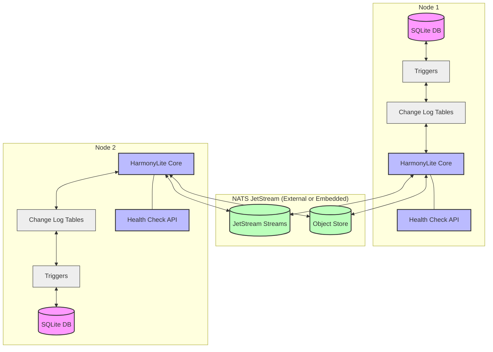
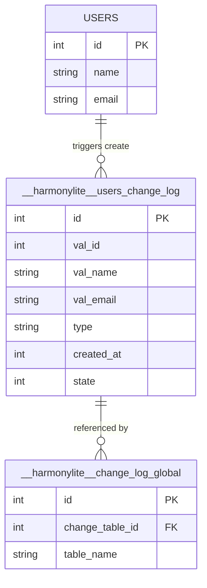
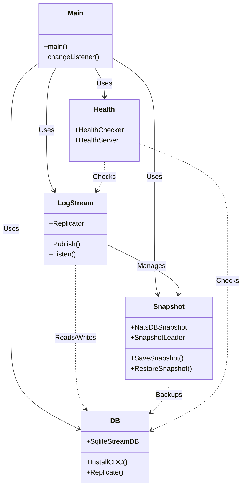
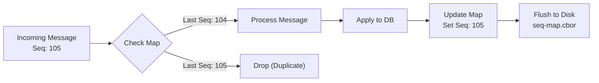
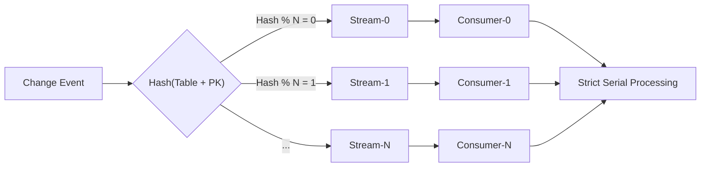
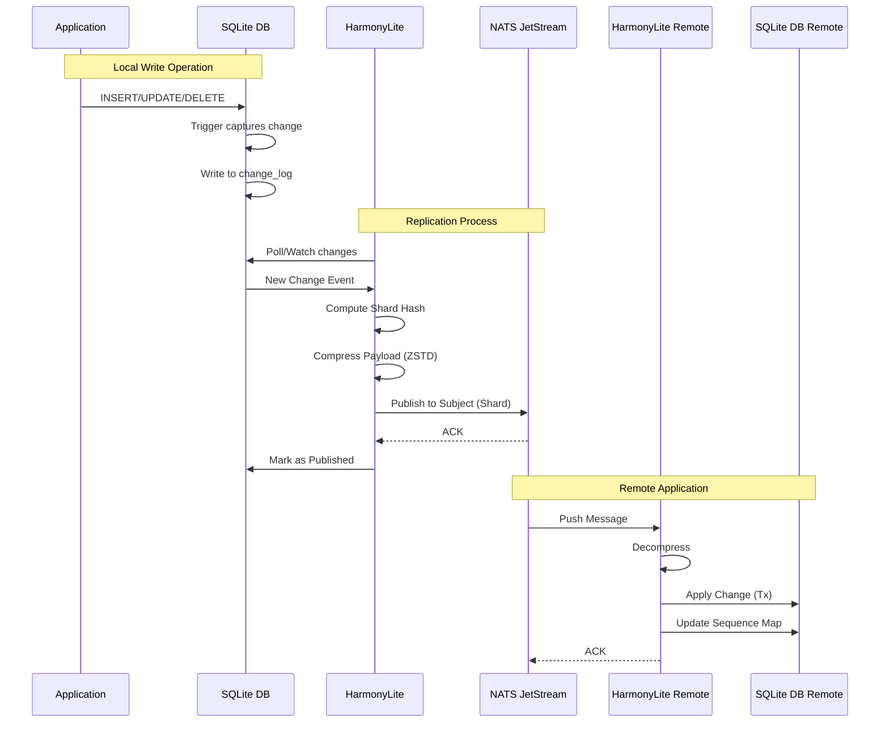
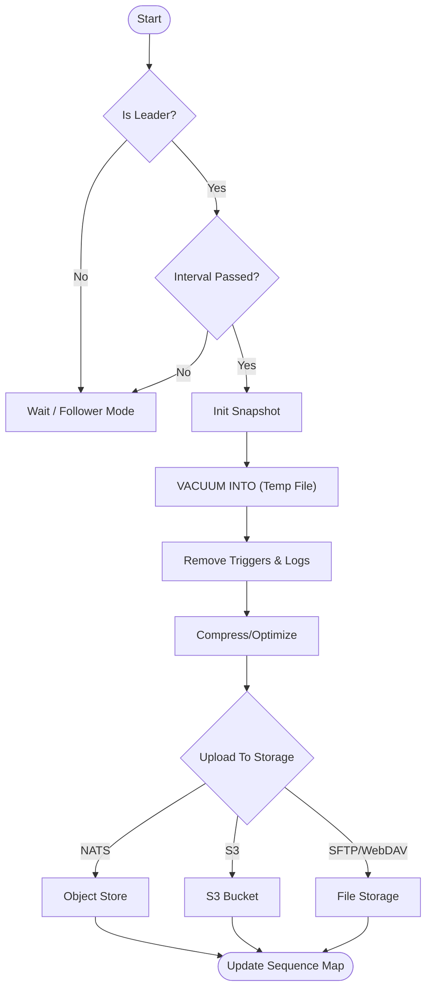
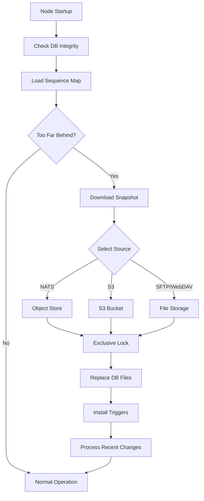

# Architecture

This document explains the core architecture, components, and design principles behind HarmonyLite. Understanding these concepts will help you better implement, configure, and troubleshoot your HarmonyLite deployment.

:::tip TL;DR
HarmonyLite is an AP system (Availability + Partition Tolerance) that uses SQLite triggers to capture changes, NATS JetStream to distribute them, and a last-writer-wins strategy for conflict resolution. Any node can accept writes, and all nodes eventually converge to the same state.
:::

:::note Reading Guide
This is the recommended starting point for understanding HarmonyLite. After this, read [Replication](replication.md) for details on how changes propagate, then [Snapshots](snapshots.md) for recovery mechanisms.
:::

## Architectural Overview

HarmonyLite implements a leaderless, eventually consistent replication system for SQLite databases. The architecture consists of four main components working together:

1. **Change Data Capture (CDC)**: Monitors and records database changes
2. **Message Distribution**: Publishes and subscribes to change events
3. **Change Application**: Applies changes to local databases
4. **State Management**: Handles snapshots and recovery

The following diagram illustrates the high-level architecture:

## Core Components

### 1. Change Data Capture (CDC)

HarmonyLite uses SQLite triggers to capture all database changes:

- **Triggers**: Automatically installed on all tables to detect INSERT, UPDATE, and DELETE operations
- **Change Log Tables**: Each monitored table has a corresponding `__harmonylite__<table_name>_change_log` table
- **Global Change Log**: A master table (`__harmonylite___change_log_global`) tracks the sequence of operations

When a change occurs:
1. The trigger fires and captures the change details
2. Information is stored in the change log table
3. A reference is added to the global change log

#### Table Structure

Database changes are tracked in specialized tables with this structure:

### 2. Message Distribution

HarmonyLite uses NATS JetStream for reliable message distribution:

- **Change Detection**: Monitors the database for modifications
- **Change Collection**: Retrieves pending records from change log tables
- **Hash Calculation**: Computes a hash from table name and primary keys
- **Stream Selection**: Routes changes to specific streams based on the hash
- **Publishing**: Sends changes to NATS JetStream
- **Confirmation**: Marks changes as published after acknowledgment

This approach ensures changes to the same row are always handled in order, while allowing parallel processing of changes to different rows.

### 3. Change Application

When a node receives a change message:

1. It checks if the change was originated locally (to avoid cycles)
2. It verifies the change hasn't been applied before
3. It parses the change details (table, operation type, values)
4. It applies the change to the local database
5. It records the message sequence for recovery tracking

### 4. State Management

HarmonyLite maintains system state through:

- **Sequence Map**: Tracks the last processed message for each stream
- **Snapshots**: Periodic database snapshots for efficient recovery
- **CBOR Serialization**: Efficient binary encoding for change records

### 5. Component Design

The internal package structure follows this design:

## Sequence Map & Idempotency

The **Sequence Map** is the "brain" of HarmonyLite's reliability. It is a local file (default: `seq-map.cbor`) that maintains the state of consumption for every stream.

### Why is it critical?

1.  **Idempotency (Exactly-Once Processing)**: 
    *   In distributed systems, messages may be delivered more than once.
    *   The Sequence Map filters out duplicates by ensuring we only process `Sequence > StartSequence`.
    *   This guarantees that a database change (like an INSERT) is never applied twice, which would corrupt data.

2.  **Crash Recovery**:
    *   If a node restarts, it reads the Sequence Map to know *exactly* where it left off.
    *   It resumes consumption from `LastSequence + 1`.

### How it works

The Sequence Map is a simple Key-Value store serialized in **CBOR** (Concise Binary Object Representation) for performance and compactness.

*   **Key**: Stream Name (e.g., `harmonylite-changes-1`)
*   **Value**: Last successfully applied Sequence Number (e.g., `1042`)

## Key Mechanisms

### Leaderless Replication

Unlike leader-follower systems, HarmonyLite operates without a designated leader:

- Any node can accept writes
- Changes propagate to all nodes
- No single point of failure
- Higher write availability

### Eventual Consistency

HarmonyLite prioritizes availability over immediate consistency:

- Changes eventually reach all nodes
- Last-writer-wins conflict resolution
- No global locking mechanism
- Non-blocking operations

### Sharding

Change streams can be sharded to improve performance:

- Each shard handles a subset of rows
- Determined by hashing table name and primary keys
- Enables parallel processing
- Configurable via `replication_log.shards`

### Message Flow

The complete message flow looks like this:

## Snapshot and Recovery

### Snapshot Creation

Snapshots provide efficient node recovery:

### Node Recovery

When a node starts or needs to catch up:

## Understanding Trade-offs

### CAP Theorem Positioning

HarmonyLite makes specific trade-offs according to the CAP theorem:

- **Consistency**: Eventual (not strong)
- **Availability**: High (prioritized)
- **Partition Tolerance**: Maintained

This positions HarmonyLite as an AP system (Availability and Partition Tolerance) rather than a CP system.

### Suitable Use Cases

HarmonyLite is ideal for:
- Read-heavy workloads
- Systems that can tolerate eventual consistency
- Applications needing high write availability
- Edge computing and distributed systems

### Less Suitable Use Cases

HarmonyLite may not be the best choice for:
- Strong consistency requirements
- Complex transactional workloads
- Financial systems requiring immediate consistency
- Systems with strict ordering requirements

## Performance Characteristics

### Scalability

- **Read Scalability**: Excellent (horizontal)
- **Write Scalability**: Good (limited by conflict resolution)
- **Node Count**: Practical up to dozens of nodes

### Latency

- **Local Operations**: Minimal impact (~1-5ms overhead)
- **Replication Delay**: Typically 50-500ms depending on network
- **Recovery Time**: Proportional to changes since last snapshot

### Resource Usage

- **Memory**: Moderate (configurable)
- **CPU**: Low to moderate
- **Disk**: Additional space for change logs and snapshots
- **Network**: Proportional to change volume and compression settings

## Next Steps

- [Replication Details](replication.md) - Deep dive into the replication process
- [Snapshots](snapshots.md) - How snapshots and recovery work
- [Configuration Reference](configuration-reference.md) - Complete configuration options