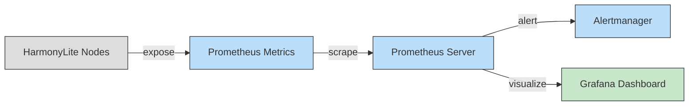

# Deployment

---

## Configuration Example

Here's an annotated configuration example:

```toml
# Database path
db_path="/path/to/your.db"

# Unique node identifier
node_id=1

# Path to persist sequence map for tracking processed messages
# Critical for warm restarts and efficient recovery
seq_map_path="/path/to/seq-map.cbor"

[replication_log]
shards=4          # Number of streams for parallel processing
max_entries=1024  # Max changes per stream
replicas=3        # Stream replicas for fault tolerance
compress=true     # Enable zstd compression

[snapshot]
enabled=true
store="nats"      # Storage backend ("nats", "s3", "webdav", "sftp")
interval=3600000  # Snapshot every hour (ms)

[nats]
urls=["nats://server1:4222", "nats://server2:4222"]
subject_prefix="harmonylite-change-log"
stream_prefix="harmonylite-changes"
```

---

## Performance Considerations

- **Shards**: Increase for high-write workloads to distribute load (costs more resources).
- **Compression**: Enable for large text/binary data to save bandwidth (adds CPU overhead).
- **Snapshot Interval**: Shorter intervals speed recovery but increase storage use.
- **Cleanup Interval**: Frequent cleanup reduces disk usage but may increase write load.
- **Sequence Map**: Regularly updating prevents message reprocessing, but adds I/O overhead.

---

## Monitoring and Troubleshooting

HarmonyLite offers robust tools for monitoring and diagnostics.

### Prometheus Metrics

Enable metrics in the config:

```toml
[prometheus]
enable=true
bind=":3010"
namespace="harmonylite"
subsystem="replication"
```

Key metrics:

| Metric           | Type     | Description                              |
|------------------|----------|------------------------------------------|
| `published`      | Counter  | Successfully published change records    |
| `pending_publish`| Gauge    | Records awaiting publication             |
| `count_changes`  | Histogram| Latency counting changes (µs)            |
| `scan_changes`   | Histogram| Latency scanning change rows (µs)        |



### Logging

Configure structured logging:

```toml
[logging]
verbose=true
format="json"  # Or "console"
```

Monitor logs for:
- `"Unable to publish"`: Replication issues.
- `"Snapshot saved"`: Successful snapshots.
- `"Cleaned up DB change logs"`: Housekeeping.
- `"Waiting checkpoint..."`: Sequence map updates.

### NATS Health

Monitor NATS using endpoints like `http://<nats-server>:8222/` for server status and JetStream metrics.

### Common Issues

#### Replication Delays
- **Symptoms**: Rising `pending_publish`, delayed propagation.
- **Solutions**: Check network, increase `max_entries`, or add shards.

#### Snapshot Failures
- **Symptoms**: `"Unable to save snapshot"`, missing snapshots.
- **Solutions**: Verify storage connectivity, ensure disk space, check for DB locks.

#### Data Divergence
- **Symptoms**: Inconsistent query results.
- **Solutions**: Coordinate schema changes, reinstall triggers, restore snapshots.

#### Sequence Map Corruption
- **Symptoms**: Message reprocessing, excessive snapshot restores.
- **Solutions**: Check disk I/O, restore from backup, increase CBOR write durability.

### Diagnostics Commands

```bash
# Force snapshot
harmonylite -config config.toml -save-snapshot

# Clean artifacts
harmonylite -config config.toml -cleanup
```

---

## Advanced Topics

- **Replica Types**: Configure read-only (`publish=false`) or write-only (`replicate=false`) nodes.
- **Disaster Recovery**: Use snapshots and logs for recovery (future docs planned).
- **Scaling**: Add nodes by updating `urls` and restarting (future docs planned).