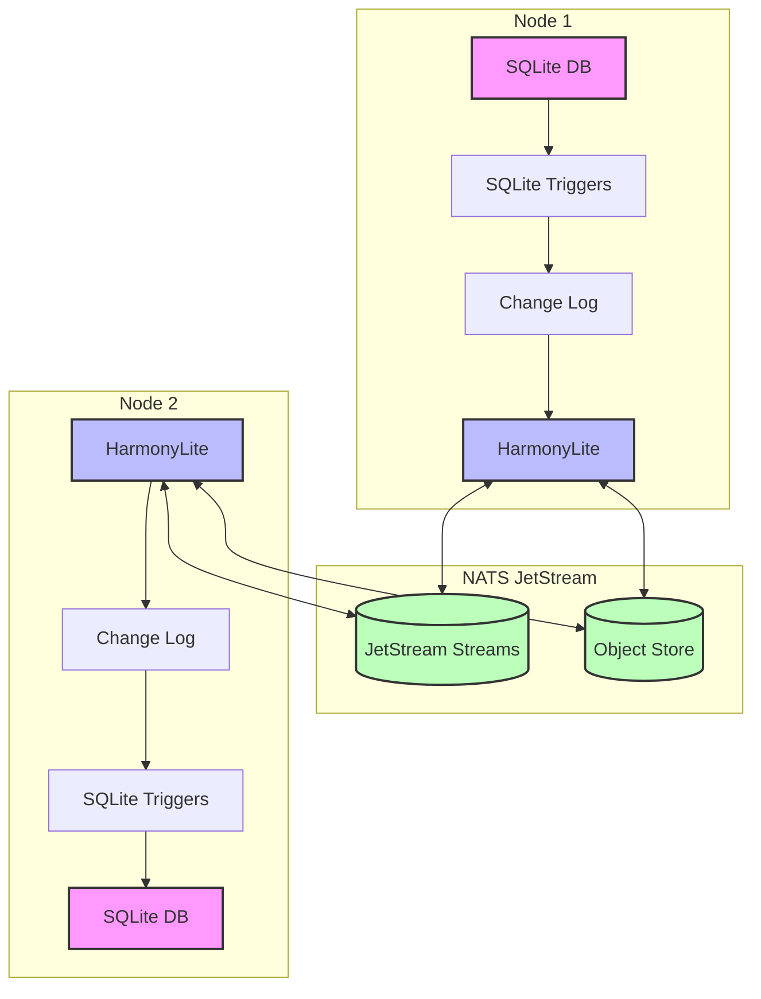
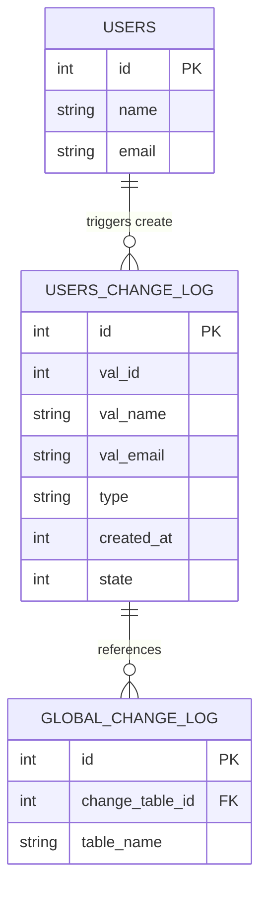
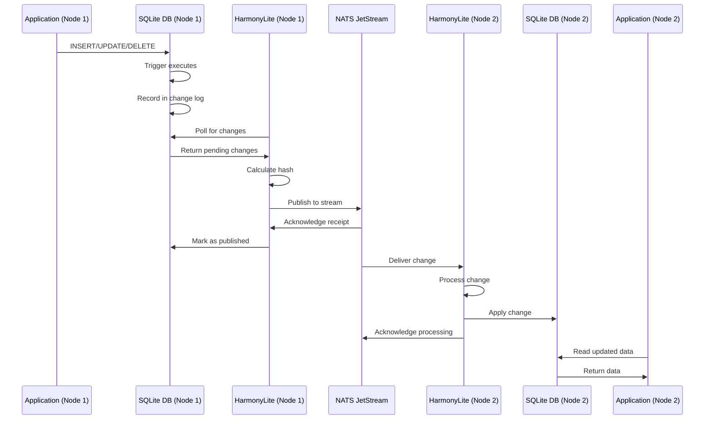
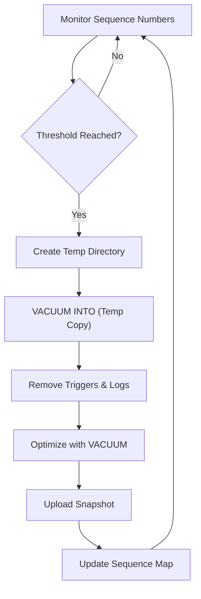
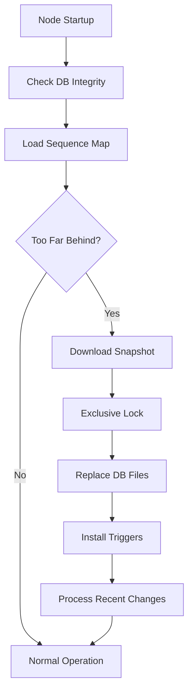
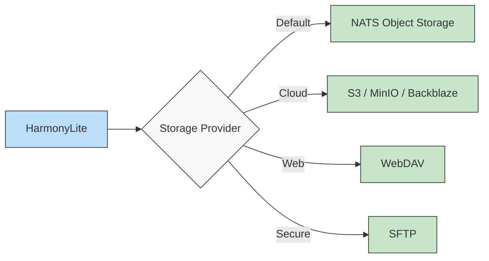
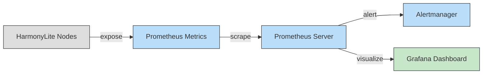

# How It Works

HarmonyLite is a distributed SQLite replication system designed to provide leaderless, eventually consistent replication across multiple nodes. It enhances SQLite by enabling seamless data synchronization without a central point of control, making it ideal for distributed applications. This document explains the core components, mechanisms, and design choices that power HarmonyLite.

---

## Architecture Overview

HarmonyLite orchestrates distributed SQLite replication through four key components:

1. **Change Data Capture (CDC)**: SQLite triggers monitor all database changes.
2. **NATS JetStream**: Provides reliable messaging and consensus for replication.
3. **Node Coordination**: Manages replication across distributed nodes.
4. **Snapshot Management**: Synchronizes database states for new or offline nodes.

The following Mermaid diagram illustrates this architecture:



**Explanation**: Each node runs a SQLite database with triggers that capture changes into local change logs. The HarmonyLite process on each node communicates these changes via NATS JetStream streams, while snapshots are stored in an object store for recovery. This setup ensures all nodes remain synchronized without a leader.

---

## Triggers and Data Capture

HarmonyLite uses SQLite triggers to capture database modifications efficiently:

- **Global Change Log Table**: `__harmonylite___global_change_log` tracks the sequence of all database operations.
- **Per-Table Change Logs**: Each monitored table has a dedicated `__harmonylite__<table_name>_change_log` table storing changed values.
- **Column Mapping**: Original column names are prefixed with `val_` (e.g., `id` becomes `val_id`) in change logs.
- **Automatic Setup**: Triggers are generated using Go templates and installed when HarmonyLite starts.

The relationship between these elements is depicted below:



### Why Triggers?

HarmonyLite opts for SQLite triggers over alternatives like parsing the Write-Ahead Log (WAL) because triggers:
- Offer row-level precision and reliability.
- Automatically fire on `INSERT`, `UPDATE`, and `DELETE` operations.
- Require no additional parsing logic or manual intervention.

### Trigger Implementation

For each table, HarmonyLite creates three triggers (`INSERT`, `UPDATE`, `DELETE`) that execute after changes are committed. Here’s a simplified `INSERT` trigger example:

```sql
CREATE TRIGGER __harmonylite__users_change_log_on_insert
AFTER INSERT ON users
BEGIN
    INSERT INTO __harmonylite__users_change_log(
        val_id, val_name, val_email, 
        type, created_at, state
    ) VALUES(
        NEW.id, NEW.name, NEW.email,
        'insert',
        CAST((strftime('%s','now') || substr(strftime('%f','now'),4)) AS INT),
        0 -- Pending state
    );

    INSERT INTO __harmonylite___global_change_log (change_table_id, table_name)
    VALUES (
        last_insert_rowid(),
        'users'
    );
END;
```

- **INSERT/UPDATE**: Capture `NEW` values.
- **DELETE**: Capture `OLD` values.
- **State**: `0` indicates "Pending" (awaiting replication).

---

## Replication Process

HarmonyLite’s replication workflow ensures changes propagate across nodes consistently:

1. **Change Detection**: Monitors SQLite DB and WAL files for updates.
2. **Change Collection**: Retrieves pending records from change log tables.
3. **Hash Calculation**: Computes a hash from table name and primary keys.
4. **Stream Selection**: Routes changes to a JetStream stream based on the hash.
5. **Publishing**: Sends changes to NATS JetStream.
6. **Confirmation**: Marks changes as published after JetStream acknowledgment.
7. **Replay**: Applies changes to local tables on receiving nodes.
8. **Consistency**: Ensures order via RAFT consensus in JetStream.
9. **Conflict Resolution**: Uses a "last-writer-wins" strategy for conflicts.

This process is visualized in the following sequence diagram:



### Why Hashing?

Hashing ensures changes to the same row are routed to the same JetStream stream, enabling parallel processing and horizontal scaling while maintaining order for each row.

---

## Changelog Format

Changes are serialized using CBOR (optionally compressed with zstd) and transmitted with this structure:

```json
{
  "FromNodeId": 1,
  "Payload": {
    "Id": 123,
    "Type": "insert",
    "TableName": "users",
    "Row": {
      "id": 456,
      "name": "John Doe",
      "email": "john@example.com"
    }
  }
}
```

This format ensures all necessary data is included for replaying changes on other nodes.

---

## Snapshot Management

Snapshots accelerate recovery for nodes joining the cluster or recovering from extended downtime.

### Benefits

Snapshots reduce recovery time by allowing nodes to restore from a recent state and apply only subsequent changes, rather than replaying all historical logs.

### Snapshot Creation



### Snapshot Restoration



### Frequency and Triggers

Snapshots are created based on:
- **Sequence Thresholds**: Triggered when `max_entries ÷ shards` is reached.
- **Time Intervals**: Configurable via the `interval` setting.
- **Manual Commands**: Using `harmonylite -save-snapshot`.

---

## Storage Options

HarmonyLite supports multiple snapshot storage backends:

- **NATS Object Storage**: Default, integrated with JetStream.
- **S3-Compatible**: Ideal for cloud environments (e.g., AWS S3, MinIO).
- **WebDAV**: Suits web-based storage.
- **SFTP**: Offers secure file transfers.



**Choosing a Backend**: Use NATS for simplicity if already using JetStream, S3 for cloud deployments, and WebDAV/SFTP for on-premises flexibility.

---

## Configuration Example

Here’s an annotated configuration example:

```toml
# Database path
db_path="/path/to/your.db"

# Unique node identifier
node_id=1

[replication_log]
shards=4          # Number of streams for parallel processing
max_entries=1024  # Max changes per stream
replicas=3        # Stream replicas for fault tolerance
compress=true     # Enable zstd compression

[snapshot]
enabled=true
store="nats"      # Storage backend ("nats", "s3", "webdav", "sftp")
interval=3600000  # Snapshot every hour (ms)

[nats]
urls=["nats://server1:4222", "nats://server2:4222"]
subject_prefix="harmonylite-change-log"
stream_prefix="harmonylite-changes"
```

---

## Performance Considerations

- **Shards**: Increase for high-write workloads to distribute load (costs more resources).
- **Compression**: Enable for large text/binary data to save bandwidth (adds CPU overhead).
- **Snapshot Interval**: Shorter intervals speed recovery but increase storage use.
- **Cleanup Interval**: Frequent cleanup reduces disk usage but may increase write load.

---

## Monitoring and Troubleshooting

HarmonyLite offers robust tools for monitoring and diagnostics.

### Prometheus Metrics

Enable metrics in the config:

```toml
[prometheus]
enable=true
bind=":3010"
namespace="harmonylite"
subsystem="replication"
```

Key metrics:

| Metric           | Type     | Description                              |
|------------------|----------|------------------------------------------|
| `published`      | Counter  | Successfully published change records    |
| `pending_publish`| Gauge    | Records awaiting publication             |
| `count_changes`  | Histogram| Latency counting changes (µs)            |
| `scan_changes`   | Histogram| Latency scanning change rows (µs)        |



### Logging

Configure structured logging:

```toml
[logging]
verbose=true
format="json"  # Or "console"
```

Monitor logs for:
- `"Unable to publish"`: Replication issues.
- `"Snapshot saved"`: Successful snapshots.
- `"Cleaned up DB change logs"`: Housekeeping.

### NATS Health

Monitor NATS using endpoints like `http://<nats-server>:8222/` for server status and JetStream metrics.

### Common Issues

#### Replication Delays
- **Symptoms**: Rising `pending_publish`, delayed propagation.
- **Solutions**: Check network, increase `max_entries`, or add shards.

#### Snapshot Failures
- **Symptoms**: `"Unable to save snapshot"`, missing snapshots.
- **Solutions**: Verify storage connectivity, ensure disk space, check for DB locks.

#### Data Divergence
- **Symptoms**: Inconsistent query results.
- **Solutions**: Coordinate schema changes, reinstall triggers, restore snapshots.

### Diagnostics Commands

```bash
# Force snapshot
harmonylite -config config.toml -save-snapshot

# Clean artifacts
harmonylite -config config.toml -cleanup
```

---

## Advanced Topics

- **Replica Types**: Configure read-only (`publish=false`) or write-only (`replicate=false`) nodes.
- **Disaster Recovery**: Use snapshots and logs for recovery (future docs planned).
- **Scaling**: Add nodes by updating `urls` and restarting (future docs planned).
