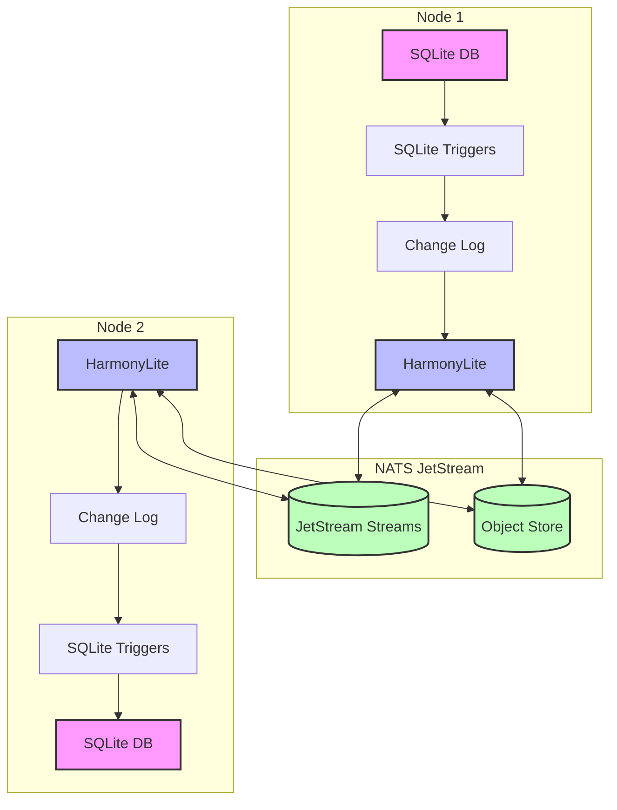

# Introduction to HarmonyLite

HarmonyLite is a distributed SQLite replication system designed to provide a leaderless, eventually consistent architecture for synchronizing SQLite databases across multiple nodes. It enhances SQLite's capabilities by enabling seamless data replication without requiring a central coordinating server.

## What is HarmonyLite?

HarmonyLite extends SQLite — the world's most widely deployed database engine — with distributed replication capabilities. While SQLite traditionally operates as a standalone database, HarmonyLite transforms it into a distributed system where multiple database instances can share and synchronize data changes across a network.

The system operates with a leaderless architecture, meaning any node can accept write operations without requiring central coordination. This approach prioritizes high availability and horizontal scalability over strong consistency guarantees.

## Key Features

- **Leaderless Architecture**: Any node can accept read and write operations without a central coordinator.
- **Eventually Consistent**: Changes propagate to all nodes, ensuring they eventually reach a consistent state.
- **Minimal Application Changes**: Works with existing SQLite applications with no code changes required.
- **Lightweight Sidecar Design**: Runs alongside your existing processes with minimal overhead.
- **Fault Tolerance**: Continues operating during temporary node failures or network partitions.
- **Horizontal Scaling**: Add more nodes to handle increased read workloads.
- **NATS Integration**: Leverages NATS JetStream for reliable message delivery and node coordination.
- **Change Data Capture**: Uses SQLite triggers to capture and propagate changes.
- **Snapshot Management**: Efficiently synchronizes new or recovering nodes.
- **Schema Versioning**: Safe rolling upgrades with automatic pause/resume on schema mismatch detection.

## When to Use HarmonyLite

HarmonyLite is ideal for:

- **Edge Computing**: Distributed applications running across multiple devices or locations.
- **Micro-Services**: Services requiring local data access with eventual synchronization.
- **Read-Heavy Workloads**: Applications that benefit from distributing read operations.
- **Offline-First Applications**: Systems that need to operate during intermittent connectivity.
- **High Availability**: Use cases where continuous operation is critical, even during node failures.

## Architecture Overview

HarmonyLite orchestrates distributed SQLite replication through four key components:

1. **Change Data Capture (CDC)**: SQLite triggers monitor and record all database changes.
2. **NATS JetStream**: Provides reliable messaging and consensus for replication.
3. **Node Coordination**: Manages replication across distributed nodes.
4. **Snapshot Management**: Synchronizes database states for new or offline nodes.

The following diagram illustrates this architecture:

## Comparison with Other Solutions

| Feature               | HarmonyLite       | rqlite           | dqlite           | LiteFS           |
|-----------------------|-------------------|------------------|------------------|------------------|
| **Architecture**      | Leaderless        | Leader-follower  | Leader-follower  | Primary-replica  |
| **Consistency**       | Eventual          | Strong           | Strong           | Strong           |
| **Write Nodes**       | All nodes         | Leader only      | Leader only      | Primary only     |
| **Application Changes** | None            | API changes      | API changes      | VFS layer        |
| **Replication Level** | Logical (row)     | Logical (SQL)    | Physical         | Physical         |

Unlike [rqlite](https://github.com/rqlite/rqlite), [dqlite](https://dqlite.io/), and [LiteFS](https://github.com/superfly/litefs), which rely on a single write node, HarmonyLite offers:

- **Write Anywhere**: Any node can accept writes, eliminating single points of failure.
- **No Locking**: Avoids performance bottlenecks from global coordination.
- **Seamless Integration**: No need to modify your application code.
- **Sidecar Design**: Runs independently alongside your application.

## Next Steps

- [Quick Start Guide](quick-start.md) - Get HarmonyLite running in minutes
- [Demo](demo.md) - See a practical demonstration with Pocketbase
- [Architecture](architecture.md) - Understand the technical details