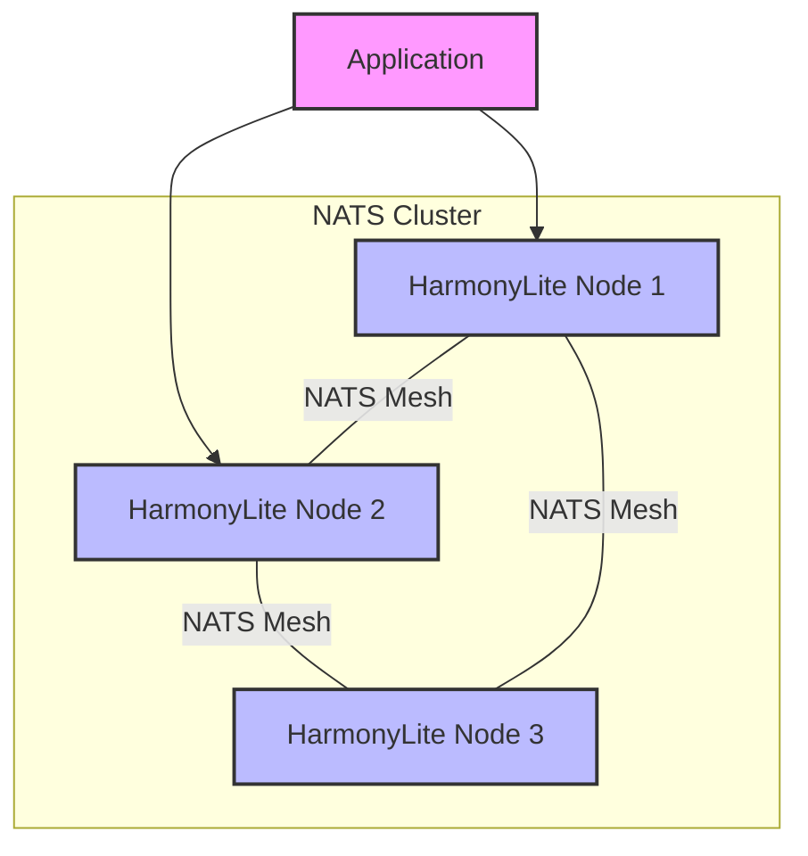
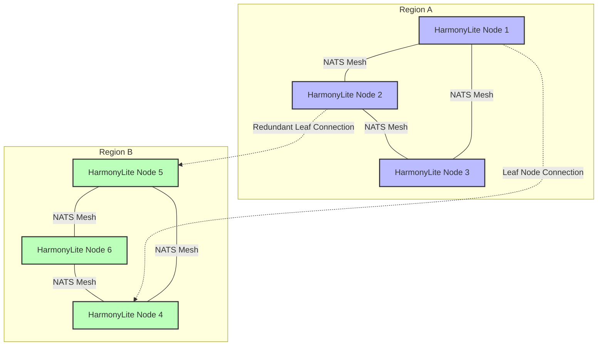

# NATS Configuration Guide

NATS serves as the foundation for HarmonyLite's replication and coordination. This guide provides detailed information about configuring NATS for optimal performance, reliability, and security.

## What is NATS?

[NATS](https://nats.io/) is a high-performance, lightweight messaging system designed for distributed systems, cloud-native applications, and IoT. It provides the messaging backbone for HarmonyLite, enabling:

- **Reliable message delivery** via JetStream persistence
- **Cluster coordination** without a central leader
- **Snapshot storage** for efficient node recovery
- **Horizontal scaling** across many nodes

## Deployment Options

HarmonyLite offers two deployment modes for NATS:

### 1. Embedded NATS Server

The simplest approach is to use HarmonyLite's embedded NATS server, which is enabled by default when no external NATS URLs are specified.

#### Configuration:

```toml
# config.toml
[nats]
# Empty URLs array = use embedded server
urls = []
```

#### Starting a Cluster with Embedded NATS:

```bash
# Node 1
harmonylite -config node1-config.toml -cluster-addr localhost:4221 -cluster-peers 'nats://localhost:4222/,nats://localhost:4223/'

# Node 2
harmonylite -config node2-config.toml -cluster-addr localhost:4222 -cluster-peers 'nats://localhost:4221/,nats://localhost:4223/'

# Node 3
harmonylite -config node3-config.toml -cluster-addr localhost:4223 -cluster-peers 'nats://localhost:4221/,nats://localhost:4222/'
```

#### Benefits:
- Simple setup with no additional software
- Zero-configuration for development and testing
- Ideal for small deployments (3-5 nodes)

#### Limitations:
- Limited tuning and monitoring options
- Bound to HarmonyLite process lifecycle
- Less suitable for large production deployments

### 2. External NATS Server

For production deployments, a dedicated external NATS cluster provides better management, monitoring, and scaling options.

#### Configuration:

```toml
# config.toml
[nats]
urls = ["nats://nats-server-1:4222", "nats://nats-server-2:4222", "nats://nats-server-3:4222"]
connect_retries = 5
reconnect_wait_seconds = 2
```

#### Starting HarmonyLite with External NATS:

```bash
# All nodes simply connect to the existing NATS cluster
harmonylite -config config.toml
```

#### Benefits:
- Independent lifecycle management
- Dedicated resources for messaging
- Advanced configuration options
- Better monitoring and operational tools
- Suitable for large-scale deployments

#### Limitations:
- Additional infrastructure to manage
- More complex initial setup

## Deployment Architectures

### Single Region Deployment

For applications hosted in a single region, we recommend a minimum of three nodes to ensure high availability:



In this configuration, all nodes are part of the same NATS cluster, providing full mesh connectivity.

### Multi-Region Deployment with Leaf Nodes

For globally distributed applications, deploy HarmonyLite with NATS leaf nodes to efficiently manage cross-region traffic:



## NATS JetStream Configuration

JetStream is NATS' persistence layer and is critical for HarmonyLite's replication. Here are key configuration parameters:

### Stream Settings

```toml
[replication_log]
# Number of streams to distribute changes
shards = 4

# Maximum stored messages per stream before purging old messages
max_entries = 1024

# Number of replicas for fault tolerance
replicas = 3

# Enable message compression to save bandwidth/storage
compress = true
```

## Production Readiness Checklist

When moving from development to production, ensure your configuration is tuned for reliability:

| Setting | Development Default | Production Recommendation | Why? |
|---------|---------------------|---------------------------|------|
| **Deployment** | Embedded | External Cluster | Independent scaling and management |
| **Shards** | 1 | 4+ | improved write throughput |
| **Replicas** | 1 | 3 | High availability and fault tolerance |
| **Storage** | File (Automatic) | File (Automatic) | Persistence is handled automatically |
| **Compression**| True | True | Reduces network and storage usage |

## Data Persistence

HarmonyLite automatically handles NATS data persistence. By default, NATS data is stored in the `nats` subdirectory relative to your configured `db_path`.

### Automatic Configuration (Recommended)

No special configuration is needed. Just ensure your `db_path` is on a persistent volume.

```toml
# config.toml
db_path = "/data/harmonylite/harmonylite.db"

# NATS data will automatically be stored in:
# /data/harmonylite/nats/
```

### Advanced Configuration (Optional)

If you need to store NATS data on a separate disk or require advanced NATS tuning, you can provide a custom NATS server configuration file:

```toml
[nats]
server_config = "/etc/harmonylite/nats-server.conf"
```

In your `nats-server.conf`:
```nats
jetstream {
    store_dir: "/mnt/fast-disk/nats-jetstream"
    max_memory_store: 1G
    max_file_store: 100G
}
```

## Security Configuration

### Authentication Options

#### 1. Username/Password

```toml
[nats]
user_name = "harmonylite"
user_password = "secure-password-here"
```

#### 2. NKeys Authentication

Generate an NKey pair:
```bash
# Install NATS CLI tools
curl -sf https://install.nats.io/install.sh | sh

# Generate a user key pair
nk -gen user > user.nkey

# Extract the public key
nk -inkey user.nkey -pubout
```

Configure HarmonyLite to use the seed file:
```toml
[nats]
seed_file = "/etc/harmonylite/user.nkey"
```

#### 3. TLS Configuration

For TLS-secured connections to NATS:

```toml
[nats]
urls = ["tls://nats-server:4222"]
tls_ca_file = "/etc/harmonylite/ca.pem"
tls_cert_file = "/etc/harmonylite/client-cert.pem"
tls_key_file = "/etc/harmonylite/client-key.pem"
```

## Monitoring NATS

Monitoring is essential for maintaining the health and performance of your NATS server, especially in production environments. NATS provides a built-in monitoring server that exposes various metrics and endpoints for real-time insights.

### Enabling the Monitoring Server

The monitoring server is enabled by configuring the `monitor_port` in your NATS server configuration:

```nats
monitor_port = 8222
```

### Accessing Monitoring Endpoints

The monitoring server provides several HTTP endpoints that expose critical metrics:

#### 1. **Server Health and Metrics**
   - **Endpoint:** `http://<server-ip>:8222/varz`
   - **Description:** Provides server health information including uptime, memory usage, and CPU usage
   - **Usage:** 
   ```bash
   curl http://localhost:8222/varz
   ```

#### 2. **Connection Information**
   - **Endpoint:** `http://<server-ip>:8222/connz`
   - **Description:** Provides information about current client connections
   - **Usage:**
   ```bash
   curl http://localhost:8222/connz
   ```

#### 3. **Route Information**
   - **Endpoint:** `http://<server-ip>:8222/routez`
   - **Description:** Provides information about routes between NATS servers in a cluster
   - **Usage:**
   ```bash
   curl http://localhost:8222/routez
   ```

#### 4. **Subscription Information**
   - **Endpoint:** `http://<server-ip>:8222/subsz`
   - **Description:** Provides information about current subscriptions
   - **Usage:**
   ```bash
   curl http://localhost:8222/subsz
   ```

#### 5. **JetStream Information**
   - **Endpoint:** `http://<server-ip>:8222/jsz`
   - **Description:** Provides information about JetStream usage
   - **Usage:**
   ```bash
   curl http://localhost:8222/jsz
   ```

### Integrating with Prometheus

NATS can be integrated with Prometheus for advanced monitoring:

1. **Install the NATS Prometheus Exporter:**
   ```bash
   wget https://github.com/nats-io/prometheus-nats-exporter/releases/download/vX.X.X/prometheus-nats-exporter-vX.X.X-linux-amd64.tar.gz
   tar -xzf prometheus-nats-exporter-vX.X.X-linux-amd64.tar.gz
   ```

2. **Configure the Exporter:**
   ```bash
   ./prometheus-nats-exporter -varz_url http://localhost:8222/varz -connz_url http://localhost:8222/connz -routez_url http://localhost:8222/routez -subsz_url http://localhost:8222/subsz -jsz_url http://localhost:8222/jsz
   ```

3. **Add the Exporter to Prometheus:**
   ```yaml
   scrape_configs:
     - job_name: 'nats'
       static_configs:
         - targets: ['localhost:7777']  # Default exporter port
   ```

4. **Visualize Metrics in Grafana:**
   - Use Grafana to create dashboards for the collected metrics

### Visualizing Metrics with Metricat

[Metricat](https://metricat.dev/) provides an alternative for real-time metric visualization:

1. Install Metricat following the instructions on their website
2. Configure Metricat to connect to your NATS monitoring endpoints
3. Use Metricat's interface to create dashboards for real-time monitoring

## Common Issues & Troubleshooting

### "NATS server not accepting connections"
**Symptoms:** Logs show connection refused errors on startup.
**Cause:** Port conflict. The default port `4222` might be in use by another service or another HarmonyLite instance.
**Fix:** Change the bind address or port in `config.toml`, or use `-cluster-addr` to specify a different port.

### "Stream not ready" or "Streams not ready, waiting..."
**Symptoms:** Node acts sluggish on startup or logs show repeated waiting messages.
**Cause:** NATS JetStream clustering takes time to elect a leader and restore state, especially after a full cluster restart.
**Fix:** This is normal during startup. If it persists for >30s, check network connectivity between nodes and ensure a quorum (majority) of nodes are online.

### "Maximum Reconnects Reached"
**Symptoms:** Node panics or shuts down after losing connection to NATS.
**Cause:** The node could not reconnect to the NATS cluster within the configured `connect_retries`.
**Fix:** Increase `connect_retries` in `config.toml` if your environment has unstable network connectivity.