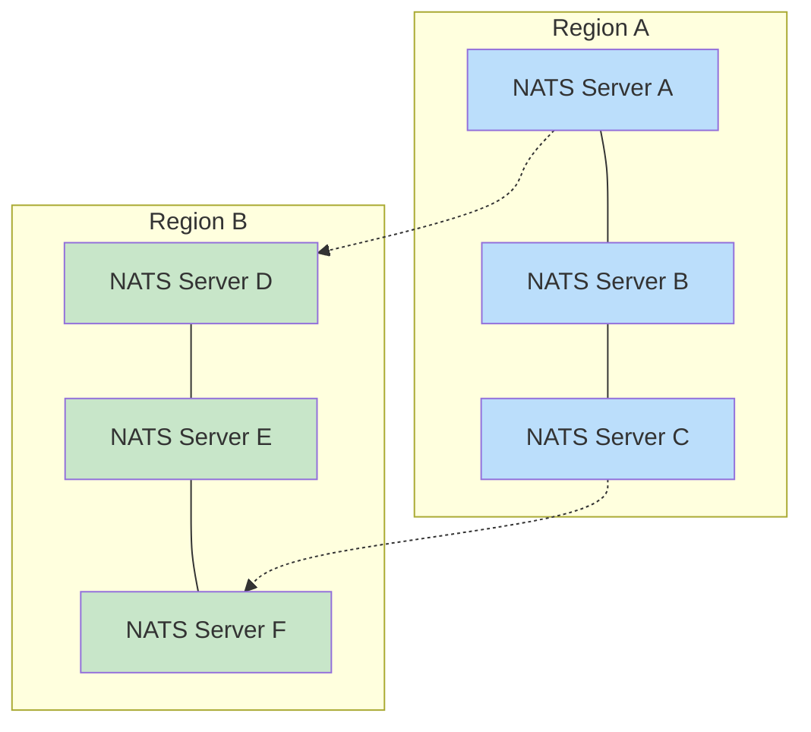

# NATS Configuration Guide

NATS serves as the foundation for HarmonyLite's replication and coordination. This guide provides detailed information about configuring NATS for optimal performance, reliability, and security.

## What is NATS?

[NATS](https://nats.io/) is a high-performance, lightweight messaging system designed for distributed systems, cloud-native applications, and IoT. It provides the messaging backbone for HarmonyLite, enabling:

- **Reliable message delivery** via JetStream persistence
- **Cluster coordination** without a central leader
- **Snapshot storage** for efficient node recovery
- **Horizontal scaling** across many nodes

## Deployment Options

HarmonyLite offers two deployment modes for NATS:

### 1. Embedded NATS Server

The simplest approach is to use HarmonyLite's embedded NATS server, which is enabled by default when no external NATS URLs are specified.

#### Configuration:

```toml
# config.toml
[nats]
# Empty URLs array = use embedded server
urls = []
```

#### Starting a Cluster with Embedded NATS:

```bash
# Node 1
harmonylite -config node1-config.toml -cluster-addr localhost:4221 -cluster-peers 'nats://localhost:4222/,nats://localhost:4223/'

# Node 2
harmonylite -config node2-config.toml -cluster-addr localhost:4222 -cluster-peers 'nats://localhost:4221/,nats://localhost:4223/'

# Node 3
harmonylite -config node3-config.toml -cluster-addr 127.0.0.1:4223 -cluster-peers 'nats://127.0.0.1:4221/,nats://127.0.0.1:4222/'
```

#### Benefits:
- Simple setup with no additional software
- Zero-configuration for development and testing
- Ideal for small deployments (3-5 nodes)

#### Limitations:
- Limited tuning and monitoring options
- Bound to HarmonyLite process lifecycle
- Less suitable for large production deployments

### 2. External NATS Server

For production deployments, a dedicated external NATS cluster provides better management, monitoring, and scaling options.

#### Configuration:

```toml
# config.toml
[nats]
urls = ["nats://nats-server-1:4222", "nats://nats-server-2:4222", "nats://nats-server-3:4222"]
connect_retries = 5
reconnect_wait_seconds = 2
```

#### Starting HarmonyLite with External NATS:

```bash
# All nodes simply connect to the existing NATS cluster
harmonylite -config config.toml
```

#### Benefits:
- Independent lifecycle management
- Dedicated resources for messaging
- Advanced configuration options
- Better monitoring and operational tools
- Suitable for large-scale deployments

#### Limitations:
- Additional infrastructure to manage
- More complex initial setup

## Optimizing NATS Storage

By default, NATS JetStream writes data to temporary directories, which isn't ideal for production. Here's how to configure a dedicated storage location:

### For Embedded NATS Server

1. **Create a NATS Config File**:

   ```
   # nats-server.conf
   jetstream {
     store_dir: "/var/lib/harmonylite/jetstream"
     max_memory_store: 52428800  # 50MB of memory
     max_file_store: 5368709120  # 5GB of disk
   }
   ```

2. **Point HarmonyLite to This Config**:

   ```toml
   [nats]
   server_config = "/etc/harmonylite/nats-server.conf"
   ```

3. **Ensure Directory Permissions**:

   ```bash
   sudo mkdir -p /var/lib/harmonylite/jetstream
   sudo chown harmonylite:harmonylite /var/lib/harmonylite/jetstream
   ```
   
## Security Configuration

### Authentication Options

#### 1. Username/Password

```toml
[nats]
user_name = "harmonylite"
user_password = "secure-password-here"
```

#### 2. NKeys Authentication

Generate an NKey pair:
```bash
# Install NATS CLI tools
curl -sf https://install.nats.io/install.sh | sh

# Generate a user key pair
nk -gen user > user.nkey

# Extract the public key
nk -inkey user.nkey -pubout
```

Configure HarmonyLite to use the seed file:
```toml
[nats]
seed_file = "/etc/harmonylite/user.nkey"
```

#### 3. TLS Configuration

For TLS-secured connections to NATS:

```toml
[nats]
urls = ["tls://nats-server:4222"]
tls_ca_file = "/etc/harmonylite/ca.pem"
tls_cert_file = "/etc/harmonylite/client-cert.pem"
tls_key_file = "/etc/harmonylite/client-key.pem"
```

## NATS JetStream Configuration

JetStream is NATS' persistence layer and is critical for HarmonyLite's replication. Here are key configuration parameters:

### Stream Settings

```toml
[replication_log]
# Number of streams to distribute changes
shards = 4

# Maximum stored messages per stream before purging old messages
max_entries = 1024

# Number of replicas for fault tolerance
replicas = 3

# Enable message compression to save bandwidth/storage
compress = true
```

### Consumer Settings

HarmonyLite automatically creates durable consumers for each node. The naming convention is:
- `harmonylite-node-<node_id>-<stream_name>-consumer`

For example: `harmonylite-node-1-harmonylite-changes-1-consumer`

## Multi-Region Deployment

For globally distributed applications, NATS can be configured to optimize cross-region traffic:



### Configuration Approach

1. **Deploy a Full NATS Cluster in Each Region**

2. **Configure Gateway Connections Between Regions**:
   ```
   # NATS server config in Region A
   gateway {
     name: "region-a"
     port: 7222
     gateways: [
       {name: "region-b", url: "nats://region-b-gateway:7222"}
     ]
   }
   ```

3. **Configure HarmonyLite to Connect to Local NATS Servers**:
   ```toml
   # For nodes in Region A
   [nats]
   urls = ["nats://region-a-server-1:4222", "nats://region-a-server-2:4222"]
   
   # For nodes in Region B
   [nats]
   urls = ["nats://region-b-server-1:4222", "nats://region-b-server-2:4222"]
   ```

## Monitoring NATS

### Built-in Monitoring Endpoint

NATS includes a built-in monitoring endpoint accessible via HTTP:

```
http://nats-server:8222/
```

This provides information about:
- Server status and connections
- JetStream status
- Cluster status
- Stream and consumer metrics

### Prometheus Integration

Enable Prometheus metrics in your NATS server configuration:

```
http_port: 8222


prometheus {
  port: 7777
}
```

### Key Metrics to Monitor

| Metric | Description | Alert Threshold |
|--------|-------------|----------------|
| `nats_jetstream_messages_count` | Total stored messages | N/A (trend) |
| `nats_jetstream_bytes_used` | Storage usage | >80% capacity |
| `nats_jetstream_consumer_ack_pending` | Pending message acknowledgments | >1000 for >5 min |
| `nats_jetstream_consumer_delivered_msgs` | Messages delivered to consumers | N/A (trend) |
| `nats_server_connections` | Connected clients | >90% of configured maximum |

## Common Issues and Solutions

### Connection Problems

**Symptoms**: HarmonyLite logs show "Unable to connect to NATS" errors.

**Solutions**:
- Verify NATS server addresses in `urls` are correct
- Check network connectivity and firewalls
- Ensure authentication credentials are correct
- Increase `connect_retries` and `reconnect_wait_seconds`

### Stream Creation Failures

**Symptoms**: "Failed to create stream" errors in logs.

**Solutions**:
- Verify NATS server has JetStream enabled
- Check storage capacity on NATS server
- Ensure proper permissions for JetStream operations
- Reduce `max_entries` or increase storage limits

### Message Publication Timeouts

**Symptoms**: High `pending_publish` metrics, slow replication.

**Solutions**:
- Increase number of shards (`replication_log.shards`)
- Enable compression (`replication_log.compress = true`)
- Check network latency between nodes
- Verify NATS server has sufficient resources

### Snapshot Storage Errors

**Symptoms**: "Unable to store snapshot" errors in logs.

**Solutions**:
- Verify NATS Object Store is properly configured
- Check disk space on NATS server
- Increase file size limits in NATS configuration
- Configure a different snapshot storage backend

## Best Practices

1. **Always Use Multiple NATS Servers** for high availability, at least three for a full cluster.

2. **Configure Proper Storage Paths** for JetStream data, avoiding `/tmp` for production.

3. **Enable Authentication** in production environments, preferably using NKeys or TLS.

4. **Monitor NATS Health** using the HTTP monitoring port and Prometheus metrics.

5. **Adjust Memory and Storage Limits** based on your workload characteristics.

6. **Implement Regular Backups** of NATS JetStream data for disaster recovery.

7. **Scale Shards with Write Volume** to maintain performance as your application grows.

8. **Use Compression** for high-volume or bandwidth-constrained environments.