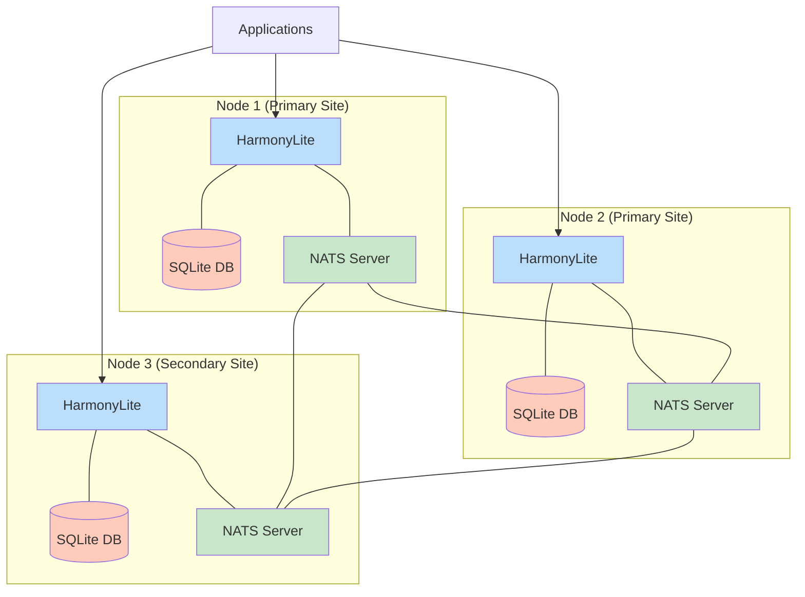
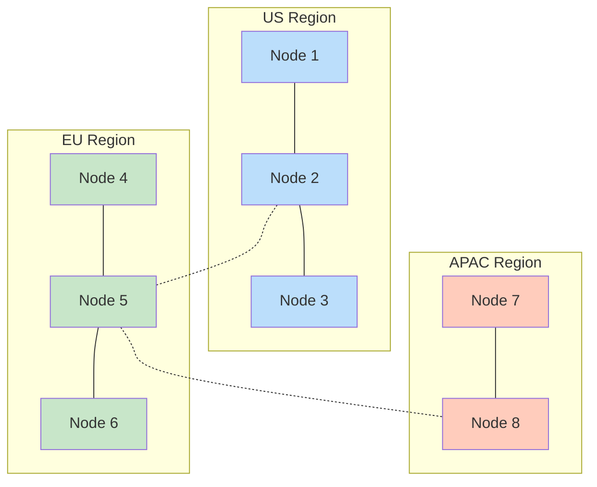

# Production Deployment Guide

This guide provides comprehensive recommendations for deploying HarmonyLite in production environments. It covers hardware requirements, deployment architecture, security, monitoring, and maintenance procedures to ensure a reliable, high-performance system.

## System Requirements

### Hardware Recommendations

For production deployments, we recommend the following specifications per node:

| Component | Minimum | Recommended | High-Performance |
|-----------|---------|-------------|------------------|
| CPU | 2 cores | 4 cores | 8+ cores |
| RAM | 2 GB | 4-8 GB | 16+ GB |
| Storage | 20 GB SSD | 100+ GB SSD | 500+ GB NVMe SSD |
| Network | 100 Mbps | 1 Gbps | 10 Gbps |

Notes:
- CPU: Each additional core improves parallel processing capacity
- RAM: Larger for high-volume environments with many simultaneous connections
- Storage: SSD strongly recommended for performance; size based on your data volume and retention needs
- Network: Low latency is crucial for replication performance

### Operating System Recommendations

HarmonyLite works on most Linux distributions. We specifically recommend:

- Ubuntu Server 20.04/22.04 LTS
- Debian 11/12
- Amazon Linux 2/2023
- RHEL/CentOS 8 or newer

## Deployment Architecture

### Production Cluster Layout

For production deployments, we recommend a minimum of three nodes to ensure high availability:



For larger deployments, you can add additional nodes as needed, potentially with specialized roles:

- **Write-Heavy Nodes**: Optimized for high write throughput
- **Read-Only Nodes**: Configured to only replicate data
- **Edge Nodes**: Deployed closer to users for lower latency reads

### Network Configuration

Ensure these ports are open between HarmonyLite nodes:

| Port | Protocol | Purpose | Direction |
|------|----------|---------|-----------|
| 4222 | TCP | NATS client connections | Bidirectional |
| 6222 | TCP | NATS route connections | Bidirectional |
| 7222 | TCP | NATS gateway connections (multi-region) | Bidirectional |
| 8222 | TCP | NATS monitoring (optional) | Inbound |
| 3010 | TCP | Prometheus metrics (optional) | Inbound |

Use firewall rules to restrict access to these ports from unauthorized hosts.

## Storage Configuration

### File System Recommendations

For production deployments:

- **File System**: XFS or ext4
- **Mount Options**: `noatime,nodiratime` to reduce I/O overhead
- **I/O Scheduler**: `none` for NVMe SSDs, `mq-deadline` for SATA SSDs
- **RAID**: RAID-10 for high-performance setups, RAID-1 for basic redundancy

### Disk Layout

Organize your storage with separate volumes:

1. **Operating System**: 20-50 GB
2. **HarmonyLite Binaries**: 1 GB
3. **Database Files**: Size according to your data volume plus 100% growth buffer
4. **NATS JetStream Storage**: Size to accommodate at least 2x your expected change volume

Example layout for a production server:

```
/dev/sda1    /                    ext4    defaults                      50G
/dev/sda2    /var/lib/harmonylite xfs     noatime,nodiratime           200G
/dev/sda3    /var/lib/nats        xfs     noatime,nodiratime           100G
/dev/sda4    /var/log             ext4    defaults                     50G
```

## Setting Up Production Nodes

### Creating a Dedicated User

Create a system user for running HarmonyLite:

```bash
# Create user and required directories
sudo useradd -r -s /bin/false harmonylite
sudo mkdir -p /etc/harmonylite /var/lib/harmonylite /var/log/harmonylite

# Set permissions
sudo chown -R harmonylite:harmonylite /etc/harmonylite /var/lib/harmonylite /var/log/harmonylite
sudo chmod 750 /etc/harmonylite /var/lib/harmonylite /var/log/harmonylite
```

### Configuration File

Create a production configuration file at `/etc/harmonylite/config.toml`:

```toml
# Database settings
db_path = "/var/lib/harmonylite/data.db"
node_id = 1  # Unique per node
seq_map_path = "/var/lib/harmonylite/seq-map.cbor"
cleanup_interval = 30000  # 30 seconds

[replication_log]
shards = 4
max_entries = 2048
replicas = 3
compress = true

[snapshot]
enabled = true
store = "s3"  # Or another supported backend
interval = 3600000  # 1 hour

[snapshot.s3]
endpoint = "s3.amazonaws.com"
bucket = "your-backup-bucket"
path = "harmonylite/snapshots"
use_ssl = true
access_key = "your-access-key"
secret = "your-secret-key"
region = "us-west-2"

[nats]
urls = ["nats://nats-server-1:4222", "nats://nats-server-2:4222", "nats://nats-server-3:4222"]
connect_retries = 10
reconnect_wait_seconds = 5

[prometheus]
enable = true
bind = "127.0.0.1:3010"  # Only bind to localhost if using a reverse proxy

[logging]
verbose = false  # Less verbose in production
format = "json"  # Structured logging
level = "info"
file = "/var/log/harmonylite/harmonylite.log"
```

Customize configuration options for your specific environment.

### Systemd Service

Create a systemd service file at `/etc/systemd/system/harmonylite.service`:

```ini
[Unit]
Description=HarmonyLite SQLite Replication Service
After=network.target
Documentation=https://github.com/wongfei2009/harmonylite

[Service]
User=harmonylite
Group=harmonylite
Type=simple
ExecStart=/usr/local/bin/harmonylite -config /etc/harmonylite/config.toml
Restart=on-failure
RestartSec=5s
LimitNOFILE=65536
WorkingDirectory=/var/lib/harmonylite
StandardOutput=journal
StandardError=journal

# Hardening options
ProtectSystem=full
PrivateTmp=true
NoNewPrivileges=true
ProtectHome=true
ProtectControlGroups=true
ProtectKernelModules=true
ReadWritePaths=/var/lib/harmonylite /var/log/harmonylite

[Install]
WantedBy=multi-user.target
```

Enable and start the service:

```bash
sudo systemctl daemon-reload
sudo systemctl enable harmonylite
sudo systemctl start harmonylite
```

### Log Rotation

Create a logrotate configuration at `/etc/logrotate.d/harmonylite`:

```
/var/log/harmonylite/*.log {
    daily
    missingok
    rotate 14
    compress
    delaycompress
    notifempty
    create 0640 harmonylite harmonylite
    sharedscripts
    postrotate
        systemctl reload harmonylite
    endscript
}
```

## Monitoring and Alerting

### Prometheus Integration

HarmonyLite exposes metrics via the Prometheus endpoint configured in `[prometheus]`. Set up a Prometheus server to scrape these metrics:

```yaml
# prometheus.yml
scrape_configs:
  - job_name: 'harmonylite'
    scrape_interval: 15s
    static_configs:
      - targets: ['harmonylite-node-1:3010', 'harmonylite-node-2:3010', 'harmonylite-node-3:3010']
```

### Critical Metrics to Monitor

| Metric | Description | Warning Threshold | Critical Threshold |
|--------|-------------|-------------------|-------------------|
| `harmonylite_published` | Published changes counter | N/A (trend) | N/A (trend) |
| `harmonylite_pending_publish` | Pending changes | > 500 for > 5 min | > 1000 for > 10 min |
| `harmonylite_count_changes` | Change counting latency | P95 > 200ms | P95 > 500ms |
| `harmonylite_scan_changes` | Change scanning latency | P95 > 500ms | P95 > 1s |
| `harmonylite_snapshot_age` | Time since last snapshot | > 2h | > 6h |
| `harmonylite_node_status` | Node status (1=healthy) | < 1 | < 1 for > 5 min |

### Alert Rules Example

```yaml
# harmonylite_alerts.yml
groups:
- name: harmonylite
  rules:
  - alert: HarmonyLitePendingPublishHigh
    expr: harmonylite_pending_publish > 1000
    for: 10m
    labels:
      severity: critical
    annotations:
      summary: "HarmonyLite pending publish queue high"
      description: "Node {{ $labels.instance }} has {{ $value }} pending changes for over 10 minutes"

  - alert: HarmonyLiteNodeDown
    expr: harmonylite_node_status < 1
    for: 5m
    labels:
      severity: critical
    annotations:
      summary: "HarmonyLite node down"
      description: "Node {{ $labels.instance }} is not responding for over 5 minutes"
```

### Log Monitoring

Use a log aggregation system such as Elasticsearch, Loki, or Graylog to collect and analyze logs from all nodes. Configure alerts for critical error patterns.

## Backup and Recovery

### Regular Snapshots

Configure automatic snapshots with the `[snapshot]` section. For production, we recommend:

```toml
[snapshot]
enabled = true
interval = 3600000  # 1 hour
store = "s3"  # S3, WebDAV, or SFTP recommended for production
min_changes = 5000  # Minimum changes before forcing a snapshot

### Backup Strategies

Implement multiple layers of backup:

1. **HarmonyLite Snapshots**: Automatic snapshots via the configuration
2. **Database Backups**: Regular SQLite backups independent of HarmonyLite
3. **Filesystem Backups**: Server-level backups of the entire `/var/lib/harmonylite` directory

Sample backup script for SQLite:

```bash
#!/bin/bash
# /usr/local/bin/backup-harmonylite.sh

DATE=$(date +%Y%m%d-%H%M)
BACKUP_DIR="/var/backups/harmonylite"
DB_PATH="/var/lib/harmonylite/data.db"
BACKUP_PATH="${BACKUP_DIR}/harmonylite-${DATE}.db"

# Create backup directory if it doesn't exist
mkdir -p $BACKUP_DIR

# Create a backup copy using SQLite's CLI
sqlite3 $DB_PATH ".backup $BACKUP_PATH"

# Compress the backup
gzip $BACKUP_PATH

# Retain only the last 7 days of backups
find $BACKUP_DIR -name "harmonylite-*.db.gz" -type f -mtime +7 -delete

# Optional: Upload to remote storage
# aws s3 cp $BACKUP_PATH.gz s3://your-backup-bucket/harmonylite/
```

Add to crontab:
```
0 */4 * * * /usr/local/bin/backup-harmonylite.sh
```

### Recovery Procedures

To recover a node using the latest snapshot:

1. Stop the HarmonyLite service:
   ```bash
   sudo systemctl stop harmonylite
   ```

2. Remove the database and sequence map files:
   ```bash
   sudo rm /var/lib/harmonylite/data.db /var/lib/harmonylite/seq-map.cbor
   ```

3. Restart the service to trigger automatic restore:
   ```bash
   sudo systemctl start harmonylite
   ```

To recover from a backup file instead:

1. Stop the HarmonyLite service:
   ```bash
   sudo systemctl stop harmonylite
   ```

2. Remove existing database:
   ```bash
   sudo rm /var/lib/harmonylite/data.db
   ```

3. Restore from backup:
   ```bash
   sudo gunzip -c /var/backups/harmonylite/harmonylite-20230428-1200.db.gz > /var/lib/harmonylite/data.db
   sudo chown harmonylite:harmonylite /var/lib/harmonylite/data.db
   ```

4. Remove sequence map to force reinitialization:
   ```bash
   sudo rm /var/lib/harmonylite/seq-map.cbor
   ```

5. Restart the service:
   ```bash
   sudo systemctl start harmonylite
   ```

## Security Considerations

### Network Security

- Deploy nodes in a private network/VPC
- Use security groups/firewall rules to restrict access
- Consider a VPN for cross-region communication
- Use TLS for all NATS connections in production

### Authentication

For NATS authentication in production:

```toml
[nats]
# Option 1: Username/Password
user_name = "harmonylite"
user_password = "secure-random-password"

# Option 2: NKey authentication (preferred)
seed_file = "/etc/harmonylite/nkeys/user.nkey"
```

### Data Security

- Apply proper filesystem permissions
- Encrypt sensitive configuration values
- Use encrypted S3 buckets for snapshots
- Consider disk encryption for database volumes

### Secure Configuration Example

```toml
[nats]
urls = ["tls://nats-server-1:4222"]
seed_file = "/etc/harmonylite/nkeys/user.nkey"
tls_ca_file = "/etc/harmonylite/tls/ca.pem"
tls_cert_file = "/etc/harmonylite/tls/client-cert.pem"
tls_key_file = "/etc/harmonylite/tls/client-key.pem"

[snapshot.s3]
endpoint = "s3.amazonaws.com"
bucket = "your-encrypted-bucket"
use_ssl = true
access_key = "your-access-key"
secret = "your-secret-key"
region = "us-west-2"
server_side_encryption = "AES256"
```

## Scaling Strategies

### Horizontal Scaling

To scale the system horizontally:

1. Add more nodes with unique `node_id` values
2. Update NATS cluster configuration to include new nodes
3. Configure applications to distribute reads across all nodes

Writes can go to any node, but you may want to designate preferred write nodes for heavy write workloads.

### Shard Scaling

Increase the number of shards as write volume grows:

```toml
[replication_log]
shards = 8  # Start with 1-2, increase as needed
```

Each shard adds parallel processing capability but requires more NATS resources.

### Multi-Region Deployment

For global deployments, use NATS gateways to connect regions:



Use regional configurations for optimal performance:

```toml
# US nodes
[nats]
urls = ["nats://us-nats-1:4222", "nats://us-nats-2:4222"]

# EU nodes
[nats]
urls = ["nats://eu-nats-1:4222", "nats://eu-nats-2:4222"]
```

## Maintenance Procedures

### Version Upgrades

To upgrade HarmonyLite:

1. Download the new version

2. Back up configuration files:
   ```bash
   sudo cp /etc/harmonylite/config.toml /etc/harmonylite/config.toml.bak
   ```

3. Stop the service:
   ```bash
   sudo systemctl stop harmonylite
   ```

4. Replace the binary:
   ```bash
   sudo cp harmonylite /usr/local/bin/
   sudo chmod +x /usr/local/bin/harmonylite
   ```

5. Start the service:
   ```bash
   sudo systemctl start harmonylite
   ```

6. Verify logs for successful startup:
   ```bash
   sudo journalctl -u harmonylite -f
   ```

Perform upgrades one node at a time to maintain availability.

### Schema Changes

When making schema changes to your SQLite database:

1. Stop applications writing to the database
2. Apply schema changes on one node
3. Run cleanup to reset triggers:
   ```bash
   harmonylite -config /etc/harmonylite/config.toml -cleanup
   ```
4. Restart HarmonyLite on that node:
   ```bash
   sudo systemctl restart harmonylite
   ```
5. Wait for changes to replicate
6. Repeat for other nodes
7. Resume application connections

### Routine Maintenance

1. **Log Rotation**: Ensured by logrotate configuration
2. **Cleanup**: Periodically run `harmonylite -cleanup` to remove old change logs
3. **Database Optimization**: Run `VACUUM` periodically on low-traffic periods
4. **Snapshot Testing**: Periodically test recovery from snapshots

## Performance Tuning

### Database Tuning

1. Set appropriate SQLite PRAGMA values in your application:
   ```sql
   PRAGMA journal_mode = WAL;
   PRAGMA synchronous = NORMAL;
   PRAGMA cache_size = -16000;  -- 16MB cache
   PRAGMA foreign_keys = ON;
   PRAGMA temp_store = MEMORY;
   ```

2. Keep indexes efficient:
   - Index columns used in WHERE clauses
   - Avoid over-indexing (indexes have write overhead)
   - Consider partial indexes for large tables

### Replication Tuning

Adjust these parameters based on your workload:

```toml
# High write throughput
[replication_log]
shards = 8
max_entries = 4096
buffer_size = 2097152  # 2MB

# Low latency priority
cleanup_interval = 15000  # 15 seconds
```

### System Tuning

1. **Filesystem**: Adjust mount options for performance
   ```
   noatime,nodiratime,nobarrier
   ```

2. **I/O Scheduler**: Set appropriate scheduler
   ```bash
   echo none > /sys/block/nvme0n1/queue/scheduler  # For NVMe
   ```

3. **Memory Management**: Adjust swappiness
   ```bash
   echo 10 > /proc/sys/vm/swappiness
   ```

## Troubleshooting Common Issues

### Replication Delays

**Symptoms**: Changes take longer than expected to propagate.

**Solutions**:
- Check NATS connectivity between nodes
- Increase number of shards
- Check for network congestion or latency
- Verify adequate disk I/O performance

### Database Locks

**Symptoms**: "database is locked" errors in logs.

**Solutions**:
- Check for long-running transactions in your application
- Ensure applications use proper transaction handling
- Increase SQLite busy timeout in your application
- Verify proper WAL journal mode

### Memory Issues

**Symptoms**: High memory usage or out-of-memory errors.

**Solutions**:
- Tune `buffer_size` to lower value
- Decrease `max_entries` if very large
- Check for memory leaks in applications
- Consider increasing server memory

### Snapshot Failures

**Symptoms**: Snapshot creation or restoration fails.

**Solutions**:
- Check storage provider connectivity
- Verify credentials and permissions
- Ensure adequate disk space
- Check for database corruption

## Conclusion

A well-planned production deployment of HarmonyLite provides a robust foundation for distributed SQLite applications. By following these guidelines for hardware, configuration, monitoring, and maintenance, you can achieve a reliable, high-performance system that scales with your needs.

Remember these key principles:
- Start with at least three nodes for high availability
- Use proper authentication and network security
- Implement comprehensive monitoring and alerting
- Perform regular backups and test recovery procedures
- Scale horizontally as your workload grows

For additional assistance, consult the [troubleshooting guide](troubleshooting.md) or reach out to the community for support.