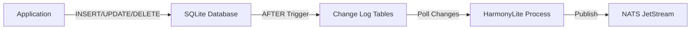
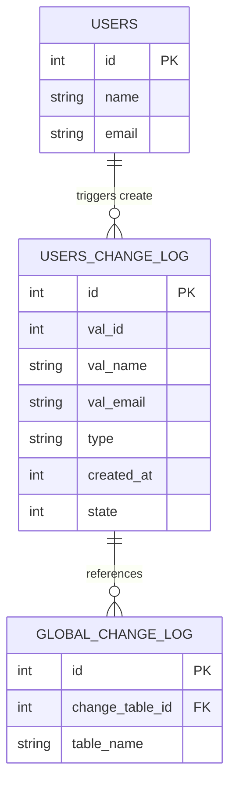
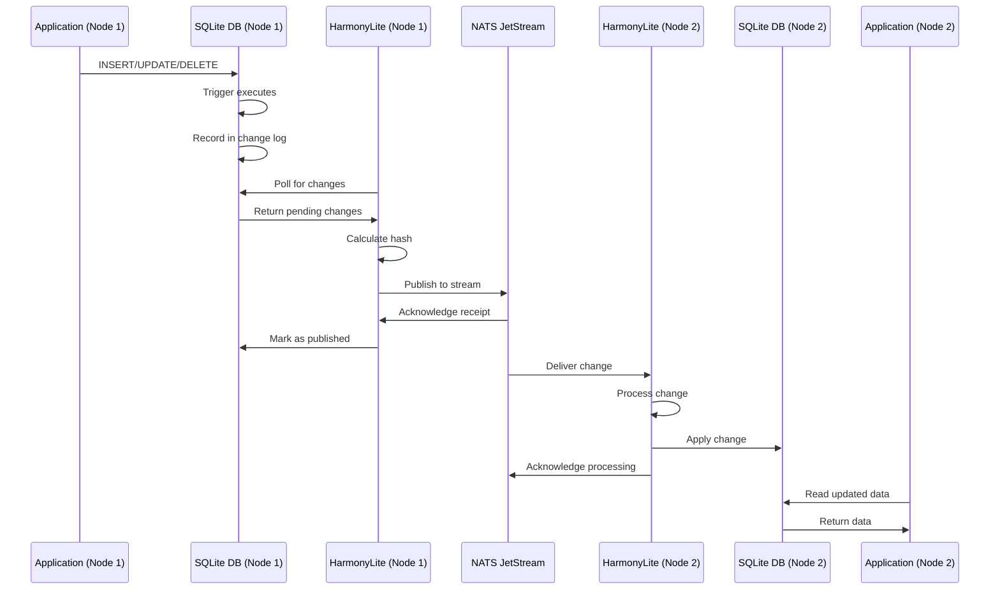
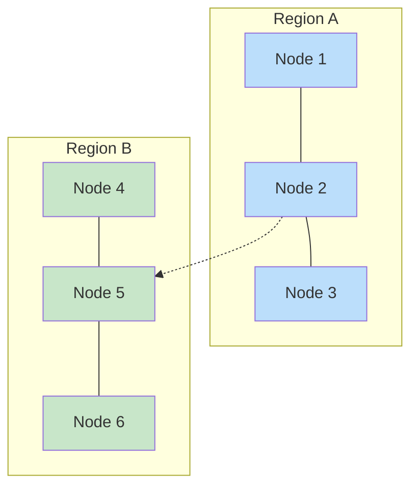
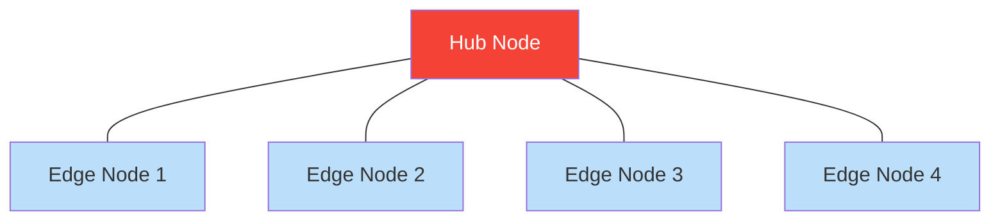
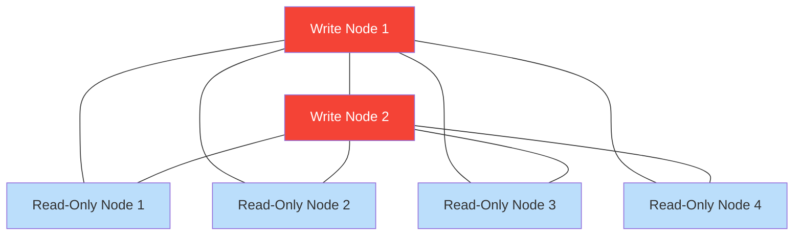

# Replication Mechanism

This document provides a deep dive into HarmonyLite's replication process, explaining how changes propagate between nodes, how conflicts are resolved, and how to optimize the system for different workloads.

## Core Principles

HarmonyLite implements a **leaderless**, **eventually consistent** replication system with the following design principles:

1. **Any node can accept writes** without coordination
2. **Changes propagate asynchronously** to all nodes
3. **Last-writer-wins** for conflict resolution
4. **Eventual consistency** rather than strong consistency
5. **Parallel processing** through sharding

This approach prioritizes **availability** and **partition tolerance** over immediate consistency, making HarmonyLite an "AP" system in terms of the CAP theorem.

## Change Data Capture (CDC)

### Trigger Mechanism

HarmonyLite captures database changes using SQLite triggers:



The system creates three triggers for each monitored table:

1. **INSERT Trigger**: Captures new row data
2. **UPDATE Trigger**: Captures modified row data
3. **DELETE Trigger**: Captures deleted row IDs

Here's a simplified example of an INSERT trigger:

```sql
CREATE TRIGGER __harmonylite__users_change_log_on_insert
AFTER INSERT ON users
BEGIN
    INSERT INTO __harmonylite__users_change_log(
        val_id, val_name, val_email, 
        type, created_at, state
    ) VALUES(
        NEW.id, NEW.name, NEW.email,
        'insert',
        CAST((strftime('%s','now') || substr(strftime('%f','now'),4)) AS INT),
        0 -- Pending state
    );

    INSERT INTO __harmonylite___global_change_log (change_table_id, table_name)
    VALUES (
        last_insert_rowid(),
        'users'
    );
END;
```

### Change Log Tables

Two types of tables track changes:

1. **Per-Table Change Logs**: Store specific changes to each table
   - Named `__harmonylite__<table_name>_change_log`
   - Contain columns for all original table fields (prefixed with `val_`)
   - Include metadata like operation type, timestamp, and state

2. **Global Change Log**: A master table (`__harmonylite___change_log_global`) tracks the sequence of operations and references specific change log entries
   - Provides a chronological record of all operations

### Schema Example



## Change Detection and Publishing

### Polling Mechanism

HarmonyLite periodically checks for changes using a polling mechanism:

1. **File Monitoring**: Watches the SQLite database and WAL files for changes
2. **Change Detection**: When changes are detected, queries the change log tables
3. **State Filtering**: Retrieves only changes in the "pending" state (state = 0)

### Hash-Based Sharding

For efficient parallel processing, changes are distributed across multiple streams based on a hash:

1. **Hash Calculation**: Computed from table name and primary key values
2. **Shard Selection**: The hash determines which stream receives the change
3. **Message Distribution**: Changes to the same row always go to the same stream

This ensures that changes to the same row are processed in order, while allowing changes to different rows to be processed in parallel.

### Change Serialization

Changes are serialized for transmission using CBOR (Concise Binary Object Representation):

```json
{
  "FromNodeId": 1,
  "Payload": {
    "Id": 123,
    "Type": "insert",
    "TableName": "users",
    "Row": {
      "id": 456,
      "name": "John Doe",
      "email": "john@example.com"
    }
  }
}
```

Optional compression using zstd can be enabled to reduce bandwidth usage.

### NATS JetStream Integration

HarmonyLite uses NATS JetStream for reliable message delivery:

1. **Stream Creation**: Creates persistent streams for each shard
2. **Publication**: Publishes changes to the appropriate stream
3. **Acknowledgment**: Waits for confirmation from NATS
4. **State Update**: Marks changes as published in the database (state = 1)

## Change Application

### Message Flow

Here's the complete message flow from one node to another:



### Processing on the Receiving Node

When a node receives a change message:

1. **Origin Check**: Verifies the change didn't originate from this node (prevents loops)
2. **Duplicate Check**: Ensures the change hasn't been applied already
3. **Table Existence**: Confirms the target table exists
4. **Operation Parsing**: Determines the operation type (INSERT, UPDATE, DELETE)
5. **SQL Generation**: Constructs appropriate SQL statements
6. **Statement Execution**: Applies the change to the local database
7. **Sequence Tracking**: Updates the sequence map for recovery purposes

### SQL Statement Generation

HarmonyLite generates SQL statements based on the operation type:

- **INSERT**: `INSERT INTO table (col1, col2) VALUES (val1, val2)`
- **UPDATE**: `UPDATE table SET col1 = val1, col2 = val2 WHERE id = ?`
- **DELETE**: `DELETE FROM table WHERE id = ?`

These statements are executed using SQLite's native APIs.

## Conflict Resolution

### Last-Writer-Wins Strategy

HarmonyLite uses a timestamp-based last-writer-wins (LWW) strategy for conflict resolution:

1. **Timestamp Comparison**: Changes include microsecond-precision timestamps
2. **Latest Wins**: When two nodes modify the same row, the later change prevails
3. **Node ID Tiebreaker**: If timestamps are identical, higher node ID wins

This approach ensures eventual consistency but may result in lost updates in high-conflict scenarios.

### Conflict Scenarios

Consider this example scenario:

1. Node 1 updates a user's email to "john@example.com" at timestamp 1000
2. Node 2 updates the same user's email to "john@company.com" at timestamp 1050
3. Both changes replicate to all nodes
4. The final state will be "john@company.com" (from Node 2) because it has a later timestamp

### Multi-Column Conflicts

If different nodes update different columns of the same row:

1. Node 1 updates a user's email at timestamp 1000
2. Node 2 updates the same user's phone at timestamp 1050
3. Column-level merging does not occur
4. The entire row from Node 2 replaces the row from Node 1
5. The email update from Node 1 is lost

## Replication Configuration

### Sharding Configuration

```toml
[replication_log]
# Number of shards for parallel processing
shards = 4

# Maximum entries per stream before cleanup
max_entries = 1024

# Number of stream replicas for fault tolerance
replicas = 3

# Enable compression for network efficiency
compress = true
```

Increasing `shards` improves parallel processing but requires more NATS resources.

### Write-Only and Read-Only Nodes

HarmonyLite supports specialized node configurations:

```toml
# Write-only node (doesn't apply incoming changes)
publish = true
replicate = false

# Read-only node (doesn't publish changes)
publish = false
replicate = true
```

These settings enable custom topologies like hub-and-spoke or primary-replica.

## Performance Considerations

### Optimizing Replication Performance

To improve replication performance:

1. **Increase Shards** for parallel processing:
   ```toml
   [replication_log]
   shards = 8  # More shards for higher throughput
   ```

2. **Enable Compression** for bandwidth efficiency:
   ```toml
   [replication_log]
   compress = true
   ```

3. **Tune Cleanup Interval** for reduced overhead:
   ```toml
   # Time in milliseconds between change log cleanup runs
   cleanup_interval = 60000  # 1 minute
   ```

### Transaction Batching

When making multiple changes, use transactions to reduce overhead:

```sql
BEGIN TRANSACTION;
INSERT INTO users (name, email) VALUES ('John', 'john@example.com');
INSERT INTO users (name, email) VALUES ('Jane', 'jane@example.com');
COMMIT;
```

This reduces trigger overhead and improves replication efficiency.

### Network Considerations

For optimal performance:

1. **Low-Latency Connections**: Keep network latency below 50ms when possible
2. **Sufficient Bandwidth**: Ensure adequate bandwidth for your change volume
3. **Reliable Network**: Use retry mechanisms for unreliable connections
4. **Regional Clustering**: Group nodes geographically for better performance

## Replication Guarantees and Limitations

### What HarmonyLite Guarantees

HarmonyLite provides these guarantees:

1. **Eventual Consistency**: All nodes eventually reach the same state
2. **Change Preservation**: Changes are not lost if a node is temporarily offline
3. **Order Preservation**: Changes to the same row are applied in order
4. **Fault Tolerance**: The system continues to function despite node failures

### Limitations

Important limitations to be aware of:

1. **No Strong Consistency**: There's a window where nodes have different states
2. **No Cross-Row Transactions**: Transactions spanning multiple tables may not be atomic across nodes
3. **Last-Writer-Wins only**: No custom conflict resolution strategies
4. **No Quorum Enforcement**: Updates proceed without waiting for acknowledgment from other nodes

## Advanced Replication Patterns

### Multi-Region Deployment

For global deployments, configure NATS gateways between regions:



This setup enables efficient cross-region replication with local write capability.

### Hub-and-Spoke Pattern

For edge computing scenarios:



### Read Scaling Pattern

For read-heavy workloads:



## Conclusion

HarmonyLite's replication mechanism provides a flexible, efficient way to maintain database consistency across distributed nodes. By understanding these internals, you can better optimize, monitor, and troubleshoot your deployment.

For more information on related topics, see:
- [Snapshots](snapshots.md) - How database state is preserved and restored
- [NATS Configuration](nats-configuration.md) - Details on messaging configuration
- [Production Deployment](production-deployment.md) - Best practices for production