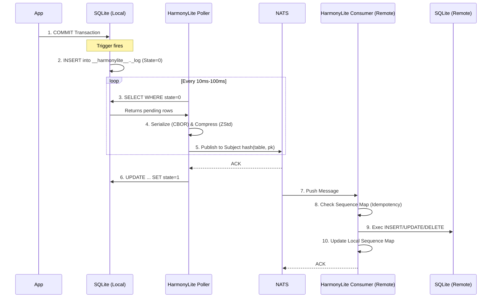

# Replication in Depth

This document details the mechanics of HarmonyLite's replication, focusing on the lifecycle of a change, failure modes, and operational edge cases.

:::tip TL;DR
HarmonyLite uses **state-based replication**. Conflict resolution is **Last-Arrival-Wins** (based on NATS message ordering). It is resilient to network partitions, but verify your NATS cluster configuration for ordering guarantees.
:::

:::note Prerequisites
This guide assumes you have read the [Architecture](architecture.md) overview and understand the basic components (Triggers, NATS JetStream, Shards).
:::

## The Lifecycle of a Change

While the architecture doc provides a high-level view, understanding the exact lifecycle of a change is crucial for debugging.



### 1. Capture (The "Pending" State)
When your application commits a transaction, the SQLite trigger **immediately** writes a copy of the row to the sidecar table (`__harmonylite__<table_name>_change_log`).
*   **State = 0 (Pending)**: The row is saved locally but not yet known to the network.
*   **Transactionality**: This happens inside *your* transaction. If your `COMMIT` fails, no change log is written.

### 2. Publication (The Poller)
The HarmonyLite process runs a background poller.
*   It SELECTs rows where `state=0`.
*   It does **not** delete them immediately. It waits for NATS acknowledgment.
*   **Crash Safety**: If the process crashes after publishing but before updating state, it will republish the same message on restart. This is why **Consumer Idempotency** is required.

### 3. Consumption (The Sequence Map)
The consumer doesn't just blindly apply SQL. It checks the **Sequence Map**.
*   Every message has a generic `SequenceID` from NATS.
*   If `IncomingSeq <= ProcessedSeq`, the message is ignored (duplicate).
*   If `IncomingSeq > ProcessedSeq + 1`, a **Gap** is detected (see "Crash Recovery" below).

## Negative Scenarios & Failure Modes

Understanding how HarmonyLite behaves when things go wrong is essential for production confidence.

### 1. Schema Mismatch (Rolling Upgrades)

**Scenario**: Node A is upgraded with a new column (`ALTER TABLE users ADD COLUMN email TEXT`). Nodes B and C still have the old schema.

**Behavior**:
*   **Detection**: When Node A publishes changes, it includes its schema hash in the message.
*   **Previous Hash Support**: Each node tracks both its current and previous schema hash. When a node upgrades, it preserves the old hash and accepts events matching *either* hash. This enables smooth rolling upgrades when multiple nodes have `publish=true`.
*   **Pause**: If an event's hash doesn't match *either* the current or previous hash, replication pauses (NAK with 30s delay).
*   **Safe State**: Messages queue up in NATS JetStream. No data is lost or corrupted.
*   **Auto-Resume**: HarmonyLite periodically recomputes the local schema (every 5 minutes during pause). Once DDL is applied locally, replication resumes automatically—**no restart required**.

**Rolling Upgrade Flow (Multiple Publishers)**:
1. Node A upgrades first → new hash `H2`, preserves `H1` as previous
2. Node B (not yet upgraded) still publishes events with hash `H1`
3. Node A receives events from B with `H1` → matches previous hash → accepted
4. Node B upgrades → now all nodes have matching current hash

**Monitoring**:
*   Check logs for `Schema mismatch detected, pausing replication` warnings.
*   Use the NATS KV registry to view cluster-wide schema state (includes both current and previous hash).

### 2. Network Partition (Split Brain)

**Scenario**: Node A and Node B lose connectivity but both remain online and accept writes from users. User 1 updates `Row X` on Node A. User 2 updates `Row X` on Node B.

**Behavior**:
*   **Local Writes Succeed**: Both nodes accept writes. HarmonyLite is an **AP** system (Available).
*   **Replication Queues Up**: Node A tries to publish to NATS. If NATS is unreachable, it retries internally. If NATS is split (e.g. clustered), messages might sit in the stream waiting for the other consumer.
*   **Resolution (Merge)**: When the partition heals, changes flow.
    *   HarmonyLite does **NOT** use wall-clock timestamps for conflict resolution.
    *   **Last Arrival Wins**: The change that arrives at the NATS server *last* determines the final state.
    *   **Field Granularity**: Overwrites are **Row-Based**, not Field-Based. If User 1 changed `email` and User 2 changed `name`, the "loser's" entire row state is replaced by the "winner's" state.

### 3. Clock Skew (The "Time Travel" Problem)

**Scenario**: Node A's system clock is set to **10:00 AM**. Node B's clock is accidentally set to **10:05 AM**.

**Behavior**:
*   **No Impact on Conflict Resolution**: Since HarmonyLite uses NATS ordering (Last Arrival Wins) rather than comparing timestamps, clock skew does **not** cause data to be overwritten based on "future" timestamps.
*   **Application Impact**: However, your *application* data might still be confusing (e.g., `created_at` columns in your user tables). It is still best practice to run NTP.

### 4. NATS Outage

**Scenario**: The NATS JetStream server crashes or is unreachable.

**Behavior**:
*   **Reads/Writes Continue**: Your application is unaffected. SQLite is local.
*   **Log Growth**: The `__harmonylite__..._log` tables will grow because `state` remains `0` (Pending).
*   **Recovery**: When NATS returns, the poller picks up valid `state=0` rows and flushes them.
*   **Disk Limit**: If NATS is down for days, your SQLite file size will increase due to the unpruned change logs. Monitor your disk usage.

### 5. Node Crash & Hard Recovery

**Scenario**: Node A crashes. It comes back online 1 hour later.

**Behavior**:
*   **Fast Catch-up**: If the NATS stream retention policy covers the 1-hour gap (e.g., you keep 24h of logs), Node A simply downloads the missing messages at high speed.
*   **Slow Catch-up (Snapshot)**: If the stream has purged the missing messages (e.g., you only keep 1h of logs and it was down for 1.1h), Node A detects a "Gap" it cannot bridge.
    *   It initiates a **Snapshot Restore**.
    *   It downloads a compressed SQLite snapshot from the object store.
    *   It **locks** the DB, swaps the files, and restarts.
    *   *Warning*: Any local writes made on Node A *during* the gap (before it realized it was behind) might be lost if the snapshot overwrites them.

## Advanced Configuration

### Excluding Tables
You may not want to replicate everything (e.g., local caches, session tables).

```toml
[sharding]
# Tables to completely ignore
ignore_tables = ["local_cache", "user_sessions"]
```

### Tuning Batch Size
If you have massive bulk inserts, tune the publisher limits to avoid NATS timeouts.

```toml
[replication]
# Max bytes per NATS message payload (default 1MB)
max_payload_mb = 4 
```

## Troubleshooting Cheat Sheet

| Symptom | Probable Cause | Fix |
| :--- | :--- | :--- |
| **Data not syncing** | NATS Connectivity | Check `nats-box` connection. Check `change_log` state is sticking at `0`. |
| **Data "reverting"** | Clock Skew | check `date` on all servers. |
| **High Disk Usage** | Logs not pruning | Verify NATS ACKs are being received so rows move to `state=1` and get pruned. |
| **"Schema mismatch" in logs** | Rolling upgrade in progress | Apply DDL to lagging nodes. Replication auto-resumes within 5 minutes (or restart for immediate detection). |
| **Replication paused** | Schema version mismatch | Check `harmonylite-schema-registry` KV for node schema hashes (includes previous hash). Upgrade lagging nodes. |
| **"Gap Detected" in logs** | Node offline too long | Default behavior is auto-snapshot restore. Increase Stream limits if this happens often. |