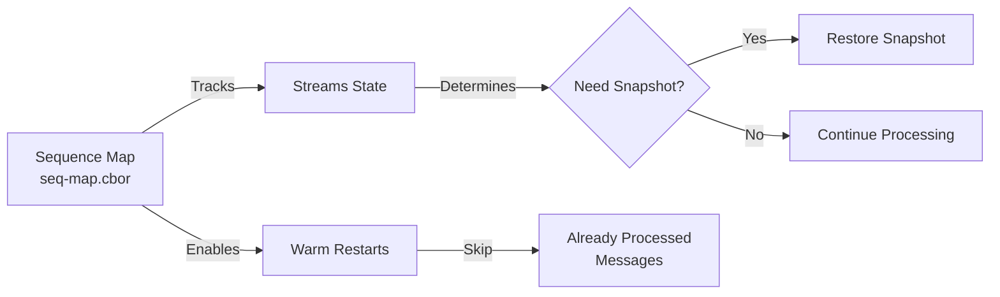
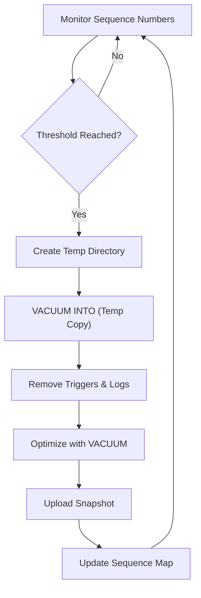
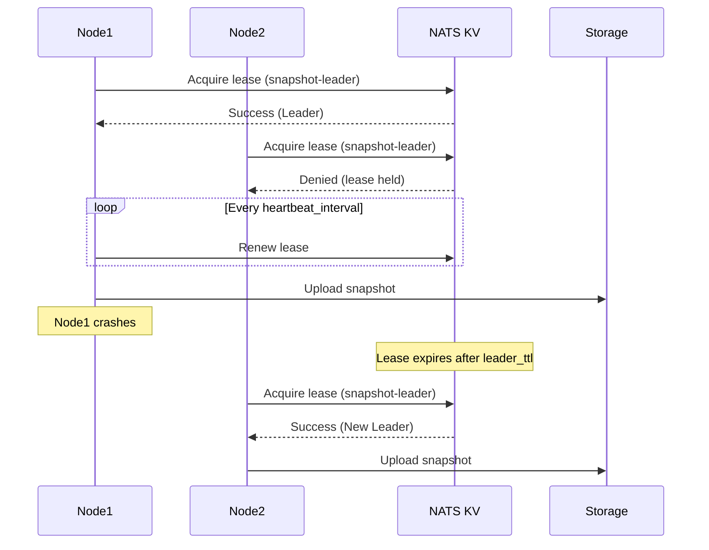

# Snapshot Management

This document explains HarmonyLite's snapshot system, which is critical for efficient node recovery and synchronization. Snapshots provide a way to quickly bootstrap new nodes or resynchronize nodes that have been offline for extended periods.

## Why Snapshots Matter

In a distributed system like HarmonyLite, snapshots serve several essential purposes:

1. **Efficient Recovery**: New or recovering nodes can start from a recent state rather than replaying all historical changes
2. **Performance Optimization**: Reduces the need to store and process all historical change logs
3. **Storage Management**: Allows for cleanup of old change records that have been superseded
4. **Disaster Recovery**: Provides point-in-time backups of database state

Without snapshots, nodes would need to replay the entire history of changes from the beginning of time, which becomes impractical as the system ages.

## How Snapshots Work

HarmonyLite's snapshot system operates through several coordinated components:

### Sequence Map

The Sequence Map is a critical component that tracks processed message sequences across JetStream shards:

- **Purpose**: Records the last processed message sequence for each stream
- **Implementation**: Stored as a key-value map (stream name → sequence number) serialized with CBOR
- **Location**: Specified via `seq_map_path` in the configuration
- **Recovery Role**: Acts as a database checkpoint to avoid reprocessing messages



### Snapshot Creation Process

Snapshots are created based on configured criteria or manual triggers:



The process involves:

1. **Determining Need**: Checking if sequence numbers have advanced enough to warrant a snapshot
2. **Creating Clean Copy**: Using SQLite's `VACUUM INTO` to create a copy without WAL files
3. **Cleaning Up**: Removing HarmonyLite-specific tables and triggers for a clean snapshot
4. **Optimizing**: Running `VACUUM` to optimize storage
5. **Storing**: Uploading the snapshot to the configured storage backend

## Leader Election for Snapshot Uploads

When multiple nodes have `publish=true`, HarmonyLite uses **leader election** to ensure only one node uploads snapshots at a time. This prevents race conditions and redundant uploads.

### Why Leader Election?

Without coordination, multiple publisher nodes could:
- Upload snapshots concurrently to the same path
- Overwrite each other's snapshots (last-write-wins)
- Cause potential corruption on non-atomic storage backends

### How It Works

Leader election uses the **NATS KeyValue store** with a lease-based mechanism:



### Configuration

```toml
[snapshot]
enabled = true
interval = 60000          # Snapshot interval in ms
leader_ttl = 30000        # Leader lease TTL in ms (default: 30000)
```

- **`leader_ttl`**: How long a leader's lease is valid. If the leader fails to renew within this time, another node can take over.
- **Heartbeat interval**: Automatically set to `leader_ttl / 3` to ensure timely renewal.

### Failover Behavior

1. **Normal operation**: The leader uploads snapshots at the configured interval
2. **Leader goes down**: The lease expires after `leader_ttl` milliseconds
3. **New leader elected**: Another publisher node acquires the lease
4. **Snapshot uploads resume**: The new leader continues uploading snapshots

> [!TIP]
> For production deployments with high availability requirements, set `publish=true` on multiple nodes. The leader election ensures only one uploads at a time, with automatic failover if the leader fails.